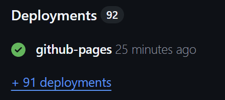

# Contrex Reporting

This application is an isokinetic knee strength assessment analysis tool that allows users to load CON-TREX measurement data, visualize it, and perform detailed analyses of muscle performance. In addition, the application allows users to generate a one-page summary and detailed analysis reports as PDFs, making it easy to document, archive, and share results with professionals such as physiotherapists, trainers, or medical staff.

Contrex Reporting builds on the [2025 student innovation project](https://github.com/tuxotiikeri/isokineettinen-lihasvoimamittaus-2025). Further development is maintained in this repository, with AI-assisted implementation guided by the laboratory's reporting needs. The original student repository remains a separate project.

## Features

- Load `.ctm` and `.cxp` files and search sessions by name, subject ID, leg, or protocol.
- Select Finnish or English for the application, charts, and PDF reports.
- Apply measurement-specific gravity correction to CTM data, enabled by default. Already corrected CXP data is not corrected a second time.
- Use movement markers together with speed-based boundaries to identify repetitions and exclude stationary parts of the movement.
- Compare quadriceps and hamstrings torque curves, repetition variability, and right/left results. Eccentric tests map flexion to quadriceps braking and extension to hamstrings braking.
- Set participant details, including sex, body mass, involved leg, and an additional comment. Select sport-specific reference values for the summaries and reports.
- Generate a one-page summary for maximal, high-speed, eccentric, and endurance strength, followed by detailed pages with charts and additional statistics.

Symmetry is calculated as involved leg / non-involved leg × 100. The report places the reference leg before the symmetry bar and the involved leg after it, so the black marker moves toward the stronger leg. If no involved leg is selected, the stronger quadriceps result in the concentric 60°/s test is used as the reference.

## Running dev environment

Install all packages:

```bash
npm install
```

Open dev environment:

```bash
npm run dev
```

The development server uses port 5175 and the `/contrex-reporting` path. Open the address shown in the terminal, usually `http://localhost:5175/contrex-reporting/`.

Run automated tests:

```bash
npm test
```

Create a production build:

```bash
npm run build
```

Preview the production build:

```bash
npm run preview
```

## Deployment

The repository includes a GitHub Pages workflow that runs whenever the main branch is updated. The workflow installs dependencies, builds the application, and deploys the contents of `dist`. GitHub Pages must be available and enabled for the deployment to succeed. The GitHub action file is located at `.github/workflows/static.yml`.

### Fixing and debugging deployment

If this repository is closed or changes location you will have to enable GitHub pages from the repository settings. When GitHub pages deployment was successful you will see a green check mark under `deployments` in the sidebar.



If the deployment was not successful here are some possible tips to fix the deployment.

1. Make sure GitHub Pages is activated in settings
    * Open settings > Pages > Build and deployment
      * Check that `source` is set to `GitHub Actions`
      * If this option is missing read ahead
2. GitHub Actions settings are missing
    * Check that GitHub Actions is enabled for this repository.
    * If Pages is unavailable, check the account's support for Pages in private repositories.
3. GitHub Pages are enabled but the deployment needs to be rerun
    * When you are inside the repository's main page click `Deployments` from the right side (See the above image for reference)
      * Here you should see a list of failed GitHub Actions. Click the dots and `View log`
      * It should then move to a page that contains a green button that reads something like `Re-run job`
      * Click this and pray that the next run will be successful
        * If the next run fails, the logs should contain more information about the reason why the deployment failed
4. Deployment is green, but how do I find the website
    * GitHub deployments should always generate the URL in a format like this: `https://{user-name}.github.io/{repository-name}/`
    * You can manually type this or find the link inside the same `Deployments` page on step 3.
5. The deployed page is empty
    * This can happen if the configured base path does not match the repository name.
    * To fix this you will have to change one code file and commit the changes to main
      * Open `vite.config.js` file from the project root
      * Find the line `base: "/contrex-reporting"`
      * Change this one line to contain the new repository name.
        * After this you will have to commit your changes and push them to main
        * This should automatically re-run the deployment and update the generated file path to match the current repository name (this may take a couple of minutes)
6. Congratulations you have either fixed the deployment or have found a bug I have not encountered and documented. If you fall into the latter category godspeed my friend.

## Code structure

All CTM file parsing helper functions are inside CTMUtils.js file. The output parsed file will mostly just follow the same structure the CTM file was already in, but there are a couple of additions.
1. `pointCollections`: This is a simple array that will usually hold a list of numbers. Most point arrays are always single dimensional, but error bands will be two dimensional lists.
    - Point collections will always contain the points and then maxValue and minValues.
2. `splitCollections`: These objects are used to index the `pointCollections`. For example we have one `pointCollection` for torque data, but then the splitCollection, will contain 6 repetitions for this data. Split will always contain `startIndex`, `endIndex` and `splits`. They can also have data for the color or disabled state of the repetitions. The idea is that `pointCollections` will always be just point and all extra metadata will be inside `splitCollection`
3. `color`: Internal repetition colors identify movement channels: `red` is extension and `blue` is flexion. These are separate from the right/left chart colors and do not directly identify a muscle in eccentric tests.

The files are loaded & parsed via web-workers/threads (./src/workers/). The idea is that all intensive calculations that can be done on other threads are done inside other threads.
1. `filterFilesFromActiveFolders`: Loads files with type .ctm/.cxp from selected folders and reads metadata for the file browser. Loading and converting files is done in batches to reduce resource usage.
2. `parseSelectedFiles`: Handles converting files to objects for use in graph displays, barcharts & .PDF generation

All used global signals are exported from a single main ./src/signals.js file to increase readability of the code.
Runtime assertions help detect invalid data and component properties. Automated tests in `test/` cover gravity correction, repetition boundaries, muscle mapping, symmetry, report metrics, and language handling. Run them with `npm test`.

Gravity correction is handled in `src/utils/gravityCorrection.js`, while repetition boundaries are handled in `src/utils/repetitionUtils.js`. Each measurement uses its own gravity lookup table and side information. The correction has been developed against knee extension/flexion data and is not a general implementation for every CON-TREX measurement pattern.

The movement-to-muscle mapping is defined in `src/utils/reportMetricDefinitions.js`. Report rows are assembled in `src/utils/reportRows.js`, and the PDF layout is generated in `src/utils/pdfUtils.js`. Reference values are stored in `src/data/referenceValues.js`, while Finnish and English translations are maintained in `src/i18n/`.

## Future improvement ideas

- Deployment in Metropolia cloud
- Expand reference values for additional sports and measurement protocols
- Validate filtering and friction compensation against additional CON-TREX exports
- Improve angle-specific H/Q curves before including them in printed reports
- Increase testing coverage

## More

The user manual is in Finnish and is located in the project root as [userManual.md](userManual.md). It covers the current application, data processing, reference values, symmetry colours, and PDF reports.


